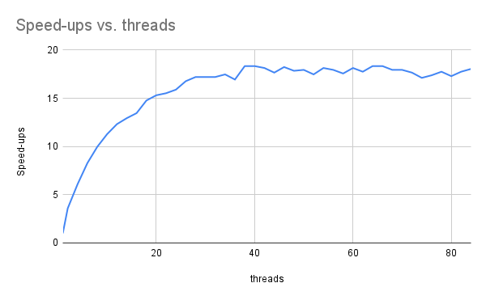
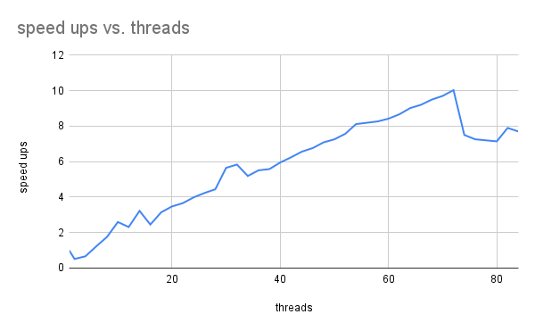

# SSU-CS-351-Class-repo
Computer architecture class I took at Sonoma State
* Project 1
* Project 2

  
Jesus Longares

Project 1

# Set up

- Testing if the outputs match
- Ran on Blue server using bash, stack size unlimited.
- Command: make test MIN_BYTES=10 MAX_BYTES=10 NUM_BLOCKS=10000 OPT="-O2"

alloca.out: list length = 10000 hash = 3090332826424574

list.out: list length = 10000 hash = 3090332826424574

malloc.out: list length = 10000 hash = 3090332826424574

new.out: list length = 10000 hash = 3090332826424574

# Testing

- Optimization experiment

Recording times

NUM_BLOCKS=10000

Bytes = 64

| OPT | alloca | list | malloc | new |
| --- | --- | --- | --- | --- |
| \-O0 -g | 0.010000 | 0.033000 | 0.008000 | 0.030000 |
| --- | --- | --- | --- | --- |
| \-O2 -g2 | 0.005000 | 0.009000 | 0.006000 | 0.010000 |
| --- | --- | --- | --- | --- |
| \-O3 | 0.003000 | 0.001000 | 0.004000 | 0.008000 |
| --- | --- | --- | --- | --- |

Notes: Alloca, and Malloc are faster compared to List and New in the first test(-O0 -g). Alloca divides half of the time as it optimization is increased, it also stays close in time with Malloc for all the trials. List and New have big difference as the optimization changes compared to the start.

Recording times

NUM_BLOCKS=100000

Bytes = 64

| OPT | alloca | list | malloc | new |
| --- | --- | --- | --- | --- |
| \-O0 -g | 0.089000 | 0.311000 | 0.081000 | 0.292000 |
| --- | --- | --- | --- | --- |
| \-O2 -g2 | 0.029000 | 0.042000 | 0.040000 | 0.042000 |
| --- | --- | --- | --- | --- |
| \-O3 | 0.026000 | 0.042000 | 0.030000 | 0.038000 |
| --- | --- | --- | --- | --- |

Notes:

- Lit and New times are larger compared to alloc and malloc. In speeds, Alloc and Malloc show that they are closely related to getting the same times, but not exactly the same. List and new show similar pattern. Once the Optimization is increased, they show that they slash about half of what it originally was

Alloc and Malloc demonstrated that they ran the fastest in the optimization test, while New and List showed they are slower compared to the others. The compiler optimization level increased showed all runtimes increase roughly cutting the original execution time by half. It optimization removes redundant instructions and inline short functions in the higher level new and list programs.

- Data per Node Tests

- MIN_BYTES and MAX_BYTES change while keeping OPT and NUM_BLOCKS constant

Opt = -O2 -g2

Num_Blocks = 200000

| Bytes/Node | alloca | list | malloc | new |
| --- | --- | --- | --- | --- |
| 10  | 0.015000 | 0.039000 | 0.025000 | 0.036000 |
| --- | --- | --- | --- | --- |
| 64  | 0.063000 | 0.082000 | 0.071000 | 0.080000 |
| --- | --- | --- | --- | --- |
| 256 | 0.209000 | 0.235000 | 0.216000 | 0.237000 |
| --- | --- | --- | --- | --- |
| 1024 | 0.877000 | 0.870000 | 0.848000 | 0.853000 |
| --- | --- | --- | --- | --- |
| 4096 | 3.234000 | 3.199000 | 3.378000 | 3.509000 |
| --- | --- | --- | --- | --- |

We can see like a exponential growth as we add more nodes. At the max, it stresses the optimization and we can see it takes longer. Time increases with Bytes/Nodes. Alloc and Malloc are the fastest to run while list and new are the slowest. As we add more nodes, we can see that the differences become slightly smaller as they become closer to eachother in terms of time.

- Chain length Sweep

Min and Max will be the same (64)

Change the Num_blocks (small quantities (10000) to large (tens of millions).)

Opt = -O2 -g2

| Num_Block | alloca | list | malloc | new |
| --- | --- | --- | --- | --- |
| 1000 | 0.000000 | 0.000000 | 0.000000 | 0.000000 |
| --- | --- | --- | --- | --- |
| 10000 | 0.001000 | 0.001000 | 0.002000 | 0.001000 |
| --- | --- | --- | --- | --- |
| 100000 | 0.035000 | 0.046000 | 0.038000 | 0.044000 |
| --- | --- | --- | --- | --- |
| 1000000 | 0.0.314000 | 0.407000 | 0.352000 | 0.401000 |
| --- | --- | --- | --- | --- |
| 10000000 | 3.133000 | 4.208000 | 3.370000 | 4.194000 |
| --- | --- | --- | --- | --- |

Alloc and Malloc both have similar times and they are usually both faster than list and new. There's big growth as we reach to the 10000000, there's a gap between the times that hints there's linear growth. Alloca works fine up to a point, but with more nodes, it would end up hitting the stack limit. Differences are consistent across all list sizes.

# Analysis and Reporting

- Which program is fastest? Is it always the fastest?

Alloca and Malloc were always the fastest. Once we started adding more values in Num_Block, we would see that it would be roughly the same with the rest of the programs.

- Which program is slowest? Is it always the slowest?

New and List were both the slowest programs, they would be both the same output. Once we started increasing the value of Num_block it would be roughly the same with the rest of the programs

- Was there a trend in program execution time based on the size of data in each Node? If so, what, and why?

A trend I noticed was that as we increased the number of nodes, it would take longer to process for runtime. It would would appear that the time would be a linear for runtime. An idea to why this might take long would be with the idea that it has to be initialized and then hased which double the work.

- Was there a trend in program execution time based on the length of the block chain?

The execution time based on the block chain would be a linear growth. I increase the block by 10x each time. Additional nodes adds a similar constant amount of work.

- Consider heap breaks, what's noticeable? Does increasing the stack size affect the heap? Speculate on any similarities and differences in programs?

Heap-based programs (malloc, new, and list) showed multiple heap breaks that increased with larger data sizes, while alloca had none since it uses the stack. Increasing the stack size doesn't affect the heap-they are separate memory regions. All programs perform similar work per node, but differ in how memory is allocated: alloca (stack), malloc (C heap), new and list (C++ heap and container overhead).

- Considering either the **malloc.cpp** or **alloca.cpp** versions of the program, generate a diagram showing two Nodes. Include in the diagram
  - the relationship of the head, tail, and Node next pointers.
  - show the size (in bytes) and structure of a Node that allocated six bytes of data
  - include the bytes pointer, and indicate using an arrow which byte in the allocated memory it points to.

Each Node has three parts: a pointer to the next Node, a size value, and a pointer (bytes\*) to its data. In a two-node list, head points to the first Node, whose next points to the second Node, and the second Node's next is NULL (the tail). Each Node allocates 6 bytes of data, and the bytes\* pointer points to the first byte of that memory block.

With malloc, the bytes are on the heap; with alloca, they're on the stack.

- There's an overhead to allocating memory, initializing it, and eventually processing (in our case, hashing it). For each program, were any of these tasks the same? Which one(s) were different?

In the memory, Alloca uses the stack, malloc and new is used for the heap, and list is the C++ container allocator. So they are all initialized the same way. The one difference is how the memory allocates and mangaged.

- As the size of data in a Node increases, does the significance of allocating the node increase or decrease?

As the size of the data in the Node increases, the significance of allocating the node decreases.Larger nodes take more time to process and hash, so there's a fixed allocation overhead has a smaller impact for runtime.

Project 2

Does it “converge” to some general value? What’s the maximum speedup you got from threading? What happens when you use more cores than are available in the hardware?
The graph converges at around the 38 thread, where it stays at around 18. It continues this thread as it longer speeds up. The speedup curve initially increases rapidly as additional threads are introduced, but it eventually converges to a nearly constant value. In this experiment, the speedup converges at around 38 threads, where it stabilizes at approximately 18×. Beyond this point, adding more threads does not result in further performance improvement.

This behavior occurs because the number of threads exceeds the number of available hardware cores. Once all cores are fully utilized, additional threads introduce scheduling overhead and contention for shared resources such as memory bandwidth, preventing further speedup and, in some cases, slightly degrading performance.

Considering the number of cores in the system, do you get a linear scaling of performance as you add more cores?

The performance does not demonstrate a scale linearly. Initial speedup is close to linear, but diminishing returns appear as thread count approaches the number of hardware cores due to serial overhead and shared resource contention.

what value would you proposed for p, and describe how you arrived at that value.

Based on the speedup graph, performance converges at a maximum speedup of approximately 18×. Using Amdahl’s Law, this corresponds to a parallelizable fraction of p ≈ 0.94, meaning about 94% of the program can be parallelized. The remaining ~6% of serial work limits further speedup as additional threads are added.

Each iteration of the mean kernel reads one double, requiring 8 bytes per iteration. Based on the total data size and runtime, the kernel achieves higher effective bandwidth with threading, but the bandwidth increase eventually plateaus as memory limits are reached. This behavior is consistent across threaded versions, indicating the computation is memory-bandwidth bound rather than compute-bound.

